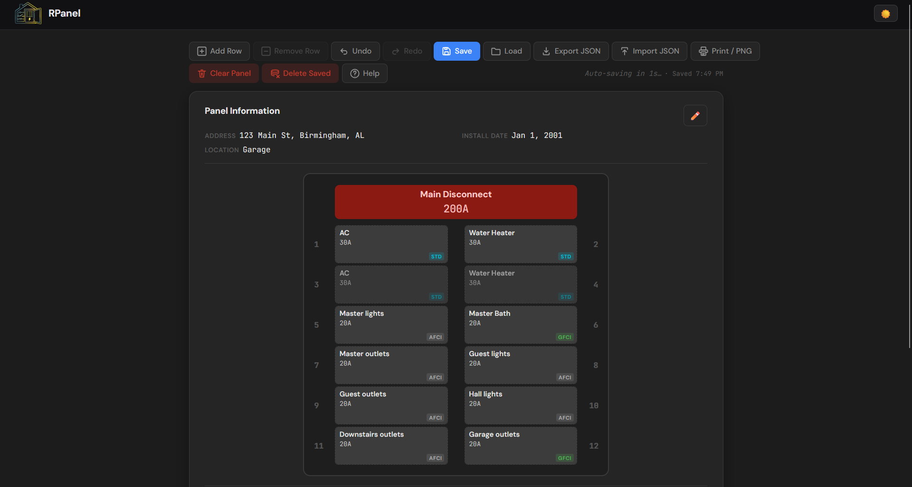

# RPanel — Residential Breaker Panel Diagrammer

A personal tool for documenting your home's electrical panel. Map every breaker slot to its circuit, label appliances and rooms, track amperage and breaker types, and export a clean reference you can hang on the panel door. Single self-contained HTML file — no build tools, no npm, no server, no accounts.

#### Demo:
https://badbox29.github.io/residental_breaker_panel_diagrammer/

---

#### Screenshot


---

## Features

- **Interactive panel diagram** — a visual breaker box with left/right slot columns; click any slot to open the edit dialog
- **Breaker types** — Standard, GFCI, AFCI, and Double-Pole (2-pole spans two adjacent slots automatically), each color-coded
- **Slot states** — Empty, Spare, or assigned; spare slots are visually distinct from empty ones
- **Per-breaker details** — label, amperage, room/location, notes, and breaker type per slot
- **2-pole breaker logic** — designating a breaker as double-pole links it to the slot directly below and cleans up both halves on delete
- **Add / remove rows** — grow or shrink the panel to match your actual box size; rows can only be removed when both slots are empty
- **Undo / redo** — full undo/redo stack for edits (Ctrl+Z / Ctrl+Y)
- **Preset library** — save named panel configurations as presets; load any preset as a starting point; add, update, or delete presets from a dedicated manager
- **Legend** — color-coded breaker type key displayed below the panel and included in print/export output
- **Print** — `window.print()` with a dedicated print stylesheet; forces light mode; hides toolbar, dialogs, and edit controls; breaker type colors preserved
- **PNG export** — high-resolution 4× scaled PNG via `html2canvas` for digital sharing; legend included; edit controls hidden
- **Save to browser** — persist the current panel to `localStorage` with a single click
- **Export / Import JSON** — download a full JSON backup of your panel; restore from backup with schema validation; merge import prompts before overwriting
- **Dark mode** — full light/dark theme toggle; defaults to dark; preference saved to `localStorage`
- **Embedded favicon** — the app logo is inlined as a base64 data URI; no external files needed
- **Fully self-contained** — one `index.html` file; works opened directly from the filesystem with no server

---

## File Structure

```
residental_breaker_panel_diagrammer/
├── index.html          # The entire app — HTML, CSS, and JS in one file
├── icon.png            # Source icon (already embedded in index.html as base64)
├── screenshot.png      # Screenshot for this README
└── README.md
```

---

## Setup

No setup required. Download `index.html` and open it in any modern browser.

For a permanent URL, drop it on GitHub Pages or any static host — no server configuration needed.

---

## Data & Privacy

All data stays in your browser. Nothing is sent anywhere.

- `localStorage` is used to save and restore your panel between sessions.
- JSON export gives you a portable backup file you control.
- There is no sync, no backend, and no external service dependencies beyond the `html2canvas` library (loaded from cdnjs).

---

## Keyboard Shortcuts

| Shortcut | Action |
|---|---|
| `Ctrl+Z` | Undo |
| `Ctrl+Y` | Redo |

---

## License

See LICENSE file.
